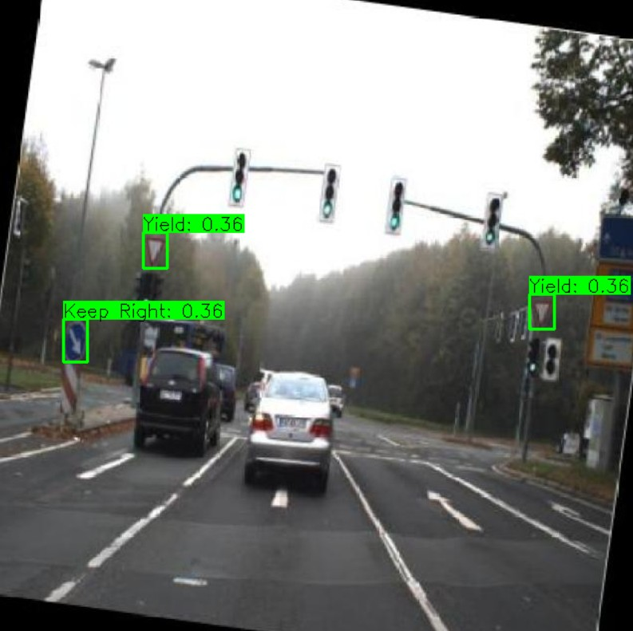
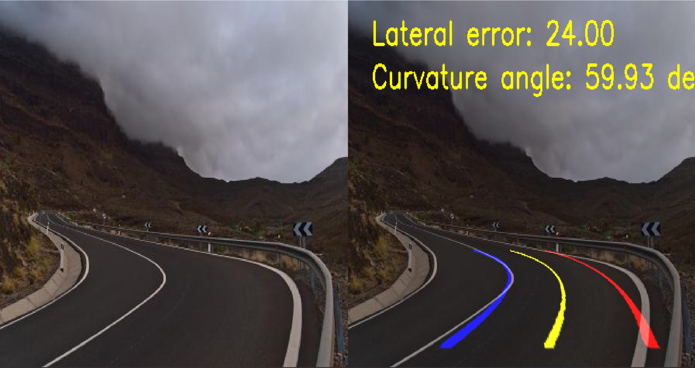
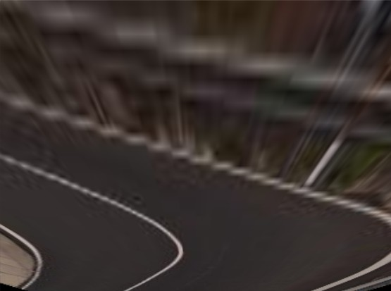
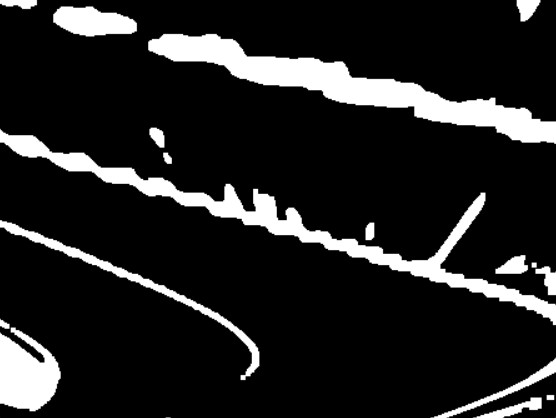
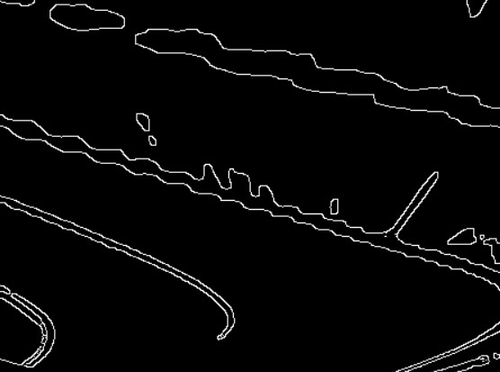
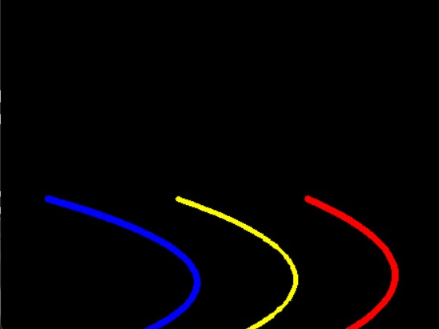
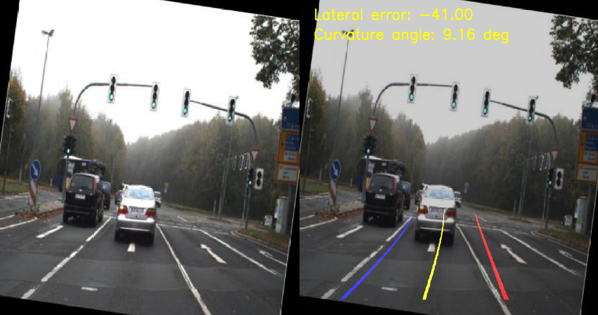
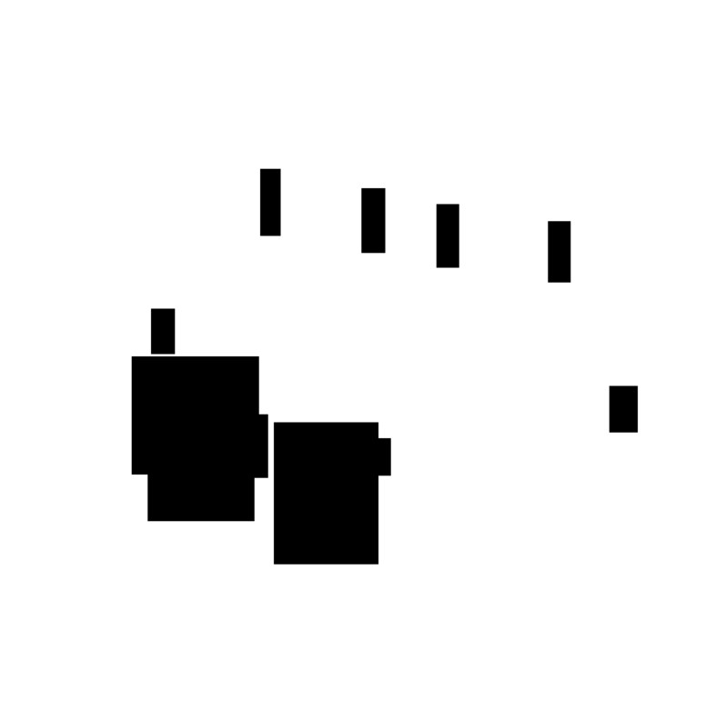

# RoadRunner  
Sistema de conducción autónoma con visión por computador

---

## Tabla de contenidos

- [¿Qué es RoadRunner?](#qué-es-roadrunner)
- [Objetivos del proyecto](#objetivos-del-proyecto)
- [Tecnologías utilizadas](#tecnologías-utilizadas)
- [Diseño 3d](#Diseño-3d)
- [Hardware](#hardware)
- [Instalación](#instalación)
- [Ejecución](#ejecución)
- [Estructura del proyecto](#estructura-del-proyecto)
- [Ejemplos visuales](#ejemplos-visuales)
- [Estado del desarrollo](#estado-del-desarrollo)
- [Simulación de funcionamiento](#simulacion-de-funcionamiento)
- [Cómo contribuir](#cómo-contribuir)
- [Licencia](#licencia)
- [Autores](#autores)

---

## ¿Qué es RoadRunner?

**RoadRunner** es un sistema de conducción autónoma desarrollado con Python y visión por computador. Su objetivo es permitir que un vehículo se mantenga dentro del carril, detecte obstáculos y reconozca señales de tráfico en tiempo real, utilizando hardware accesible como la Raspberry Pi.

---

## Objetivos del proyecto

- ✅ Mantener el coche dentro del carril de forma autónoma.  
- ✅ Detectar obstáculos u objetos en la ruta.  
- ✅ Reconocer señales de tráfico usando una cámara.

---

## Tecnologías utilizadas

- [Python 3.10](https://www.python.org/downloads/) → Usado para entrenar YOLO v8 para reconocimiento de señales
- [Python 3.12](https://www.python.org/downloads/) → Usado para el resto de funcionalidades y lógica
- [OpenCV (visión por computadora)](https://opencv.org/)  
- [TensorFlow](https://www.tensorflow.org/) / [PyTorch](https://pytorch.org/) (reconocimiento de señales)  
- [YOLO (detección de objetos)](https://docs.ultralytics.com/) → Versiones v8 y v5
- [NumPy](https://numpy.org/), [PyYAML](https://pyyaml.org/)  
- [Raspberry Pi OS](https://www.raspberrypi.com/software/)

---

## Diseño 3d

### Diseño del chasis  
[](https://github.com/1669321/RoadRunner/blob/main/Peces%203d/Chassis.stl)

### Diseño del sistema de rotación  
[](https://github.com/1669321/RoadRunner/blob/main/Peces%203d/Eix%20Rotacio.stl)

### Diseño de las llantas  
[](https://github.com/1669321/RoadRunner/blob/main/Peces%203d/Rodes.stl)


---

## Hardware

- [Raspberry Pi 4](https://tienda.bricogeek.com/placas-raspberry-pi/1330-raspberry-pi-4-model-b-4-gb.html?_gl=1*z9559f*_up*MQ..*_gs*MQ..&gclid=CjwKCAjw3_PCBhA2EiwAkH_j4iuGuv_6AWKE0E7OXbkjeWnEkRXGa-6T2kYbjGQ0lrQCCnmQOxNYghoCS0cQAvD_BwE&gbraid=0AAAAADkb14eYDWZQKLfN5T7XcqmyfW6sO)
- [Cámara Raspberry Pi v2 ](https://tienda.bricogeek.com/accesorios-raspberry-pi/823-camara-raspberry-pi-noir-v2-8-megapixels.html?_gl=1*1avbmpn*_up*MQ..*_gs*MQ..&gclid=CjwKCAjw3_PCBhA2EiwAkH_j4iuGuv_6AWKE0E7OXbkjeWnEkRXGa-6T2kYbjGQ0lrQCCnmQOxNYghoCS0cQAvD_BwE&gbraid=0AAAAADkb14eYDWZQKLfN5T7XcqmyfW6sO)
- [Controladora L298N](https://tienda.bricogeek.com/motores/285-controlador-de-motores-doble-puente-h-l298.html?_gl=1*1avbmpn*_up*MQ..*_gs*MQ..&gclid=CjwKCAjw3_PCBhA2EiwAkH_j4iuGuv_6AWKE0E7OXbkjeWnEkRXGa-6T2kYbjGQ0lrQCCnmQOxNYghoCS0cQAvD_BwE&gbraid=0AAAAADkb14eYDWZQKLfN5T7XcqmyfW6sO) 
- [2x Motores con reductora N20](https://tienda.bricogeek.com/motores/115-motor-micro-metal-dc-con-reductora-50-1.html?_gl=1*dud44b*_up*MQ..*_gs*MQ..&gclid=CjwKCAjw3_PCBhA2EiwAkH_j4iuGuv_6AWKE0E7OXbkjeWnEkRXGa-6T2kYbjGQ0lrQCCnmQOxNYghoCS0cQAvD_BwE&gbraid=0AAAAADkb14eYDWZQKLfN5T7XcqmyfW6sO)
- [Sensor ultrasónico HC-SR04](https://tienda.bricogeek.com/sensores-distancia/741-sensor-de-distancia-por-ultrasonidos-hc-sr04.html?_gl=1*1avbmpn*_up*MQ..*_gs*MQ..&gclid=CjwKCAjw3_PCBhA2EiwAkH_j4iuGuv_6AWKE0E7OXbkjeWnEkRXGa-6T2kYbjGQ0lrQCCnmQOxNYghoCS0cQAvD_BwE&gbraid=0AAAAADkb14eYDWZQKLfN5T7XcqmyfW6sO)
- [Powerbank]() 
- [Petaca de pilas 4 AA](https://tienda.bricogeek.com/componentes/160-base-para-baterias-4xaa.html?utm_source=tienda&utm_medium=click&utm_campaign=prodrel&gclid=CjwKCAjw3_PCBhA2EiwAkH_j4iuGuv_6AWKE0E7OXbkjeWnEkRXGa-6T2kYbjGQ0lrQCCnmQOxNYghoCS0cQAvD_BwE&gbraid=0AAAAADkb14eYDWZQKLfN5T7XcqmyfW6sO)

---

## Instalación

```bash
git clone https://github.com/1669321/RoadRunner.git
cd RoadRunner
pip install -r requirements.txt
```

---

## Ejecución

```bash
python main.py
```

> 💡 Asegúrate de tener conectada la cámara y los sensores antes de ejecutar el código.

---

## Estructura del proyecto

```
RoadRunner/
├── main.py                  # Script principal
├── car.py                   # Lógica del coche
├── lane_detector.py         # Detección de carril
├── overlay.py               # Visualización de datos
├── priorities.py            # Gestión de eventos
├── tf_test.py               # Prueba de señales (imagen)
├── tf_test_video.py         # Prueba de señales (vídeo)
├── test_line_detector.py    # Test de carril
├── utils_processing.py      # Utilidades de imagen
├── lane_detector/           # Módulo de carril
├── models/                  # Modelos entrenados
├── Peces 3d/                # Piezas diseñadas para imprimir en 3d y montar el coche
├── ims/                     # Imágenes de prueba
├── videos/                  # Vídeos de ejemplo
├── events.yaml              # Configuración de eventos
├── detectors.yaml           # Configuración de detectores
├── requirements.txt         # Dependencias
└── README.md
```

---

## Ejemplos visuales

### Ejemplo de reconocimiento de señal
 

*Ejemplo real de detección de señales*

 

*Video demostrativo velocidad de detección. Origen: https://www.kaggle.com/code/pkdarabi/traffic-signs-detection-using-yolov8*

 

*Video demostrativo velocidad de detección, a velocidad x0.4*

### Ejemplo detección de carril


*Imagen resultado de detección de carril*

#### Pasos Seguidos


*Transformación a vista de pájaro*



*Filtrado por color de la imagen*



*Detector de contornos mediante Canny*



*Líneas resultantes después de ajustar con polinomio de 2º grado*

### Ejemplo 2 de detección de carril


*Imagen resultado de detección de carril*



*Máscara de filtrado de objetos antes de detectar líneas*

---
## Estado del desarrollo

- ✅ Seguimiento de carril funcional  
- ✅ Detección de obstáculos básica  
- ✅ Reconocimiento de señales de tráfico  


---
## Simulación de funcionamiento


### Observaciones:

La perspectiva del vídeo es en ojo de pez, por lo que la detección de líneas no puede funcionar correctamente, o se dibujan deformadas.

En cuanto a la detección de señales hay algunas, como la de límite de velocidad a 10, que no están en el dataset de entrenamiento y, por lo tanto, no las detecta correctamente (detecta otro valor).

En este vídeo vemos, a tiempo real el cambio de estados del coche, velocidad máxima y todas las detecciones que realiza.

Finalmente, destacar que hay momentos donde el vídeo se para. Esto es debido a la implementación de los STOP. En este caso, el robot al detectar la señal se pone en modo BREAK y, cuando esta sale del plano,
se para (entendiendo que hemos llegado a la altura de la señal). Sin embargo, en este vídeo, al ser tan rápido, no se aprecia del todo bien pero eso es lo que está sucediendo. Una vez el robot ha hecho el STOP,
2 segundos de detención completa, este vuelve a reanudar su marcha si no detecta obstáculos.

---

## Licencia

Este proyecto está licenciado bajo la licencia MIT. Consulta el archivo `LICENSE` para más detalles.

---

## Autores

- Roger González  
- Oriol Alarcón  
- Pau Díaz  
- Nil Caballero
